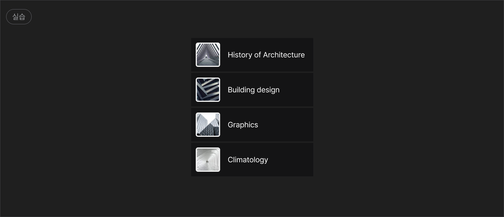
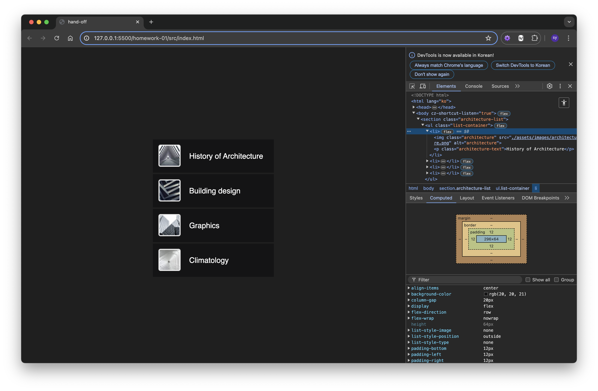

react-homework-01

# 디자인 -> 개발 핸드오프

---

### 01. 피그마 플러그인 사용

anima 플러그인 사용하여 html, css 파일 추출하였습니다.

#### 문제점

- 마크업이 div 요소로만 구성되어 있어 마크업을 다시 해야했습니다.
- 클래스명에 따른 스타일링에 중복된 코드가 있어 수정이 필요했습니다.

---

### 02. 마크업 고민

- 시맨틱 마크업을 고민해봤는데 맞게 했는지 아직도 감이 안 잡힙니다..
- 전체를 `section`으로 묶어주고, `ul` 태그를 사용하여 리스트화하였습니다.
- `li` 태그 안에 `img`와 `p` 태그를 사용하여 구성하였습니다.

### 03. CSS 스타일링

- `section` 태그를 화면 중앙에 배치하였습니다.
- `ul`의 display를 flex로 설정하고 column 방향으로 배치하였습니다.
- `li` 내부에 이미지와 텍스트를 디자인 가이드와 동일하게 배치하였습니다.

---

#### 수행 과정 요약

- 피그마의 dev 모드를 활성화하여 css 코드를 참고할 수 있었으나 정확히 어떻게 핸드오프를 진행해야할지 감이 잡히지 않아 플러그인의 힘을 빌렸습니다.
- 대략적인 틀을 잡고 마크업과 css 코드를 수정했습니다.

#### 구현 결과

#### 느낀점

- 바닐라 프로젝트를 진행하면서도 느낀거지만 피그마가 굉장히 유용한 툴임을 알 수 있었습니다.
- 여백이나 간격이 수치화되어 표기되어 있어 쉽게 스타일링을 줄 수 있었고, 이미지 에셋도 간편하게 다운로드 받을 수 있어 좋은 디자인 핸드오프 툴이라고 생각합니다.
- 다만 지금은 간단한 디자인 시안을 코드화했지만 앞으로 여러 요소와 에셋이 가득한 복잡한 디자인을 맞이하게 된다면 코드화하는 것부터 잘 할 수 있을지 굉장히 고민이 됩니다..
